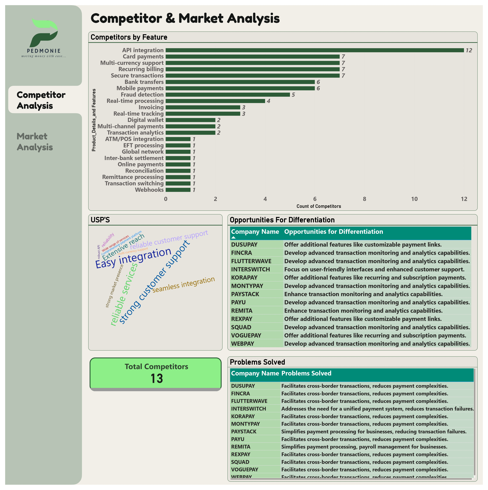
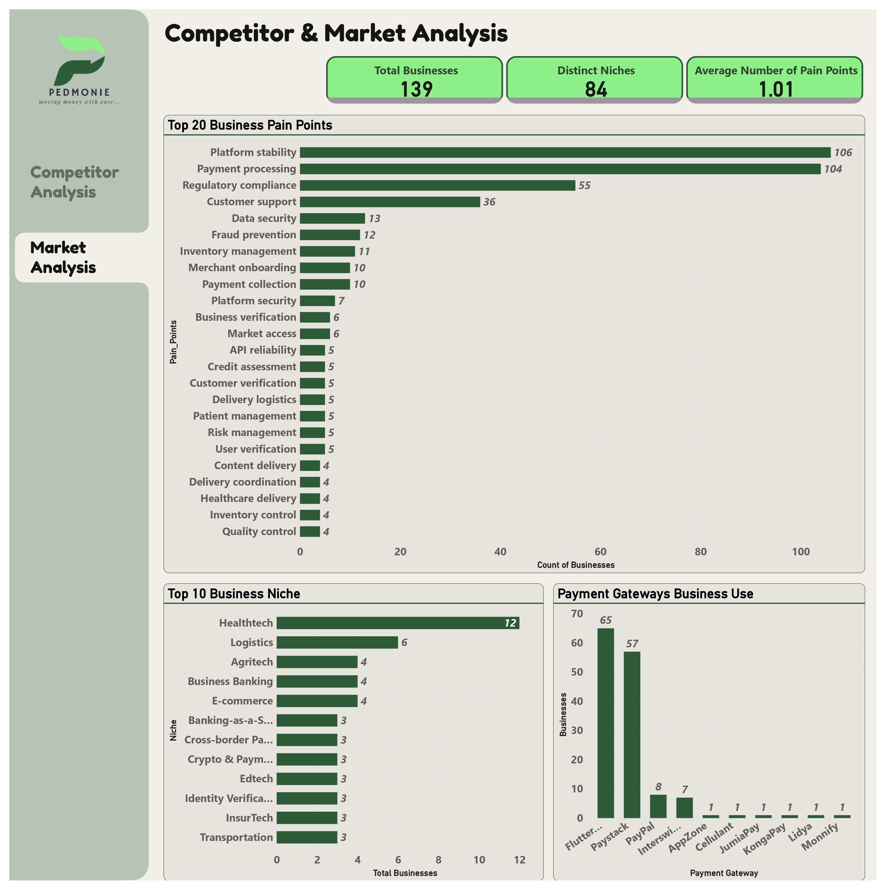

# PedMonie Market Research: Competitor & Target Audience Analysis

## Project Overview
This research report explores Nigeria's fintech landscape, analyzing key competitors such as Paystack, Flutterwave, Interswitch, Kora, Paga, and PayPal. Through comprehensive analysis of 139 businesses across 84 distinct niches, we identified major gaps in existing solutions and outlined how PEDMONIE can differentiate itself. Key findings highlight issues such as transaction failure rates, high fees, and the lack of smart payment routing.




[View Interactive Dashboard](https://app.powerbi.com/view?r=eyJrIjoiMWVhY2EyNzItMmE1Ni00OTY1LTlkZmMtN2ZmZWIzMjI2ODA5IiwidCI6IjUxN2QzNTAyLTI5MDEtNGRlMi1hODdiLTk1YzUwN2E5YTA4OCJ9)

## Problem Statement
Existing payment gateways have limitations in terms of transaction efficiency, international payments, and security compliance. Our analysis revealed significant challenges:
- Platform stability issues (106 reported pain points)
- Payment processing difficulties (104 reported issues)
- Regulatory compliance challenges (55 pain points)
- Customer support limitations (36 reported issues)
- Data security concerns (13 reported problems)

PEDMONIE aims to solve these gaps with a more seamless, cost-effective, and AI-driven payment platform.

## Research Methodology

### Approach Used
- Competitor analysis through benchmarking
- Market research using fintech industry reports
- Data collection across 139 businesses and 84 distinct niches
- Average of 1.01 pain points per business analyzed

##### Scope & Limitations:
This research is based on secondary data sources such as company websites, industry reports, and customer feedback.

### Data Sources
- [Competitor Analysis Dataset](Data/CompetitorAnalysis.csv)
- [Target Audience Dataset](Data/TargetAudience.csv)
- Company websites
- Industry reports
- Customer feedback.

## Market Analysis 

### Payment Gateway Usage
1. Flutterwave (65 businesses)
2. Paystack (57 businesses)
3. PayPal (8 businesses)
4. Interswitch (7 businesses)
5. Other gateways (1-2 businesses each)
Our research shows that PAYSTACK, FLUTTERWAVE, and INTERSWITCH already implement the 10 key features PEDMONIE aims to adopt, requiring strategic differentiation in our approach.

### Top Business Niches
1. Healthtech (12 businesses)
2. Logistics (6 businesses)
3. Agritech (4 businesses)
4. Business Banking (4 businesses)
5. E-commerce (4 businesses)

## Target Audience Analysis

### Primary Users
- Small & Medium Enterprises (SMEs): Need affordable, reliable payment solutions
- E-commerce & Subscription Platforms: Require automated billing and multi-currency support
- Freelancers & Gig Workers: Need seamless cross-border payments

### Pain Points
- High failure rates in transactions
- Expensive international payment processing
- Poor fraud detection and security concerns
- Lack of recurring payment options

### Demand for Features
- AI-driven smart payment routing to improve success rates
- Faster settlements and lower transaction costs
- Subscription billing and customizable payment links
- Enhanced fraud detection

## Opportunities for Differentiation
1. Implement AI-powered smart payment routing to select the best-performing gateway in real-time
2. Provide advanced subscription management with retry mechanisms for failed payments
3. Offer real-time dashboard with AI-driven insights on customer behavior
4. Enable instant settlements for businesses and freelancers
5. Allow businesses to accept stablecoins (USDT, USDC) and crypto payments
6. Provide white-label solutions for businesses to brand their checkout experiences
7. Introduce USSD and QR code payment solutions for offline customers
8. Ensure full multi-currency transactions with competitive FX rates

## Recommendations

### Core Development
- Develop an MVP focusing on key differentiators
- Partner with local banks & global payment providers
- Implement strong marketing & customer acquisition strategies
- Ensure compliance with CBN, EFCC, and NDPR regulations

### Long-term Strategy
1. Focus on platform stability improvements
2. Enhance security measures and fraud detection
3. Build scalable infrastructure
4. Expand payment options and integration capabilities

## Repository Structure
```
├── Data/
│   ├── competitoranalysis.csv
│   └── target audience.csv
├── Visualizations/
│   ├── CompetitiorAnalysis.jpg
│   └── MarketAnalysis.jpg
├── README.md
```

## Tools Used
- Power BI for data visualization
- SQL for data analysis
- Excel for data preprocessing
- Git for version control

## Dashboard Access
The full interactive dashboard can be accessed [here](https://app.powerbi.com/view?r=eyJrIjoiMWVhY2EyNzItMmE1Ni00OTY1LTlkZmMtN2ZmZWIzMjI2ODA5IiwidCI6IjUxN2QzNTAyLTI5MDEtNGRlMi1hODdiLTk1YzUwN2E5YTA4OCJ9).

